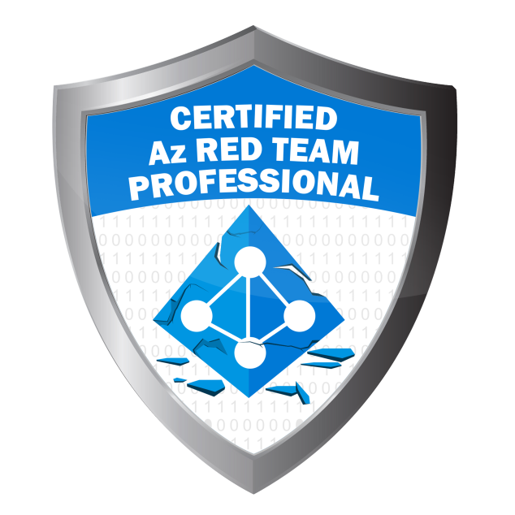

# 💫 About Me  

         
💻 **Pentester** specializing in penetration testing, vulnerability identification, and securing systems against advanced threats.  🔍 **Discovered and reported** **CVE-2023-3743**, a **critical vulnerability**.  🛠️ I have a keen interest in **malware development** and **bypassing defensive systems**, and I enjoy exploring these areas to deepen my cybersecurity knowledge. This profile features my projects, scripts, and contributions related to pentesting and offensive security.  🏃‍♂️ Outside of cybersecurity, I’m passionate about sports and playing video games.

## 💻 Certifications & Trainings
  
  
  
  
  
  
  

---
 

